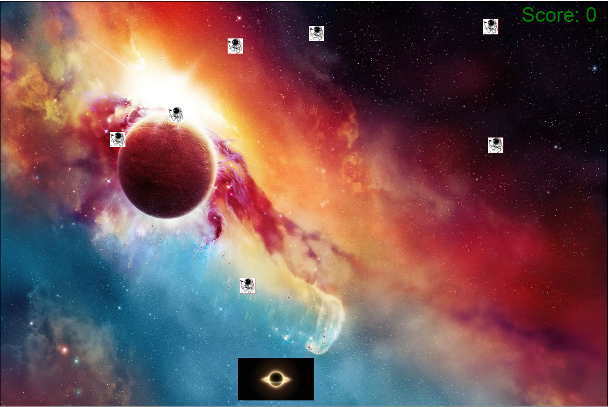
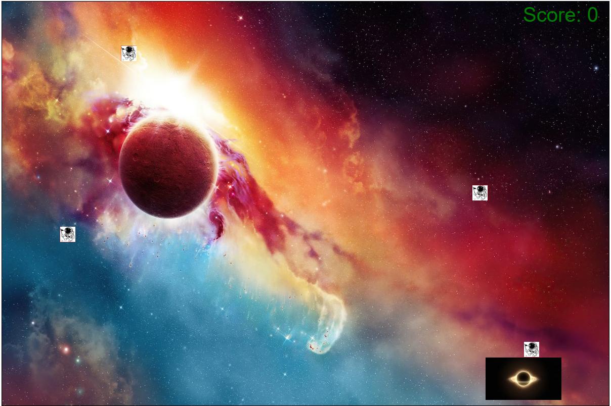
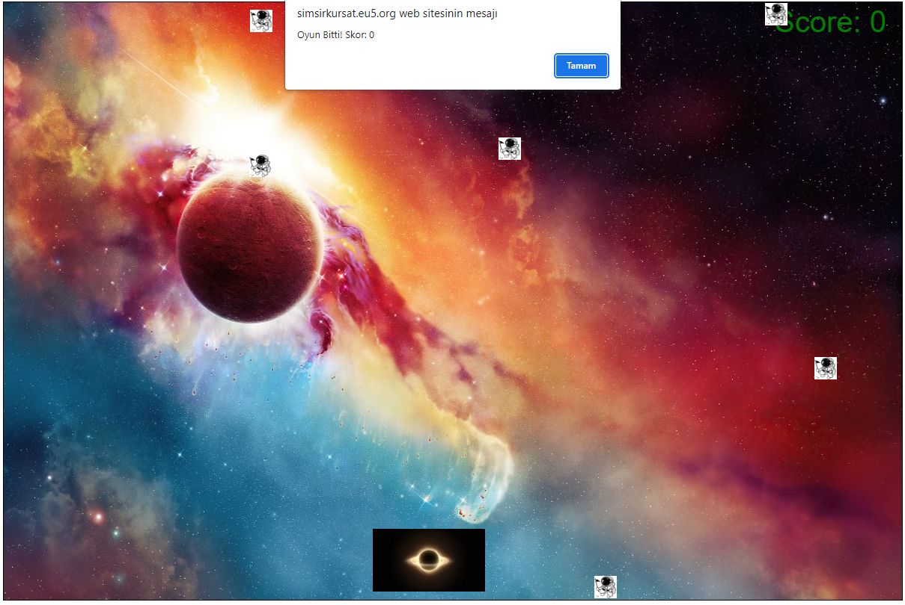

# 2DCanvasGame
 Html Canvas ile basit bir 2D oyun 

## Başlangıç
 Talimatları içerir.

### Gerekenler
 Projenin çalıştırılması için bir web tarayıcısına (Chrome,Firefox,Opera vb.) ihityacınız var.
 
### Kurulum
 1. Bu projeyi Github'dan indirin.
 2. İndirilen dosyaları bir klasöre çıkartın.

### Çalıştırma
 1. Çıkarılan klasördeki `index.html` dosyasını bir web tarayıcısında açın.
 2. Oyun, tarayıcınızın bir sekmesinde çalışacaktır.

## Nasıl Oynanır(Kurallar)
 - Oyunun amacı, düşen nesneleri kullanıcının kontrol ettiği bileşenle yakalamaktır.
 - Bileşeni fareyi kullanarak sola ve sağa hareket ettirebilirsiniz.
 - Her yakalanan nesne için skor artar.
 - Bir nesne bileşene ulaştığında, oyun biter ve skor ekranda gösterilir.

## Ekran resimleri
 1.Oyunun tarayıcı üzerinde çalışması:
  
  
 2. Oyunda objeleri yakalama pozisyonu:
  
 3. Oyunun bitmesi durumu : 
  
